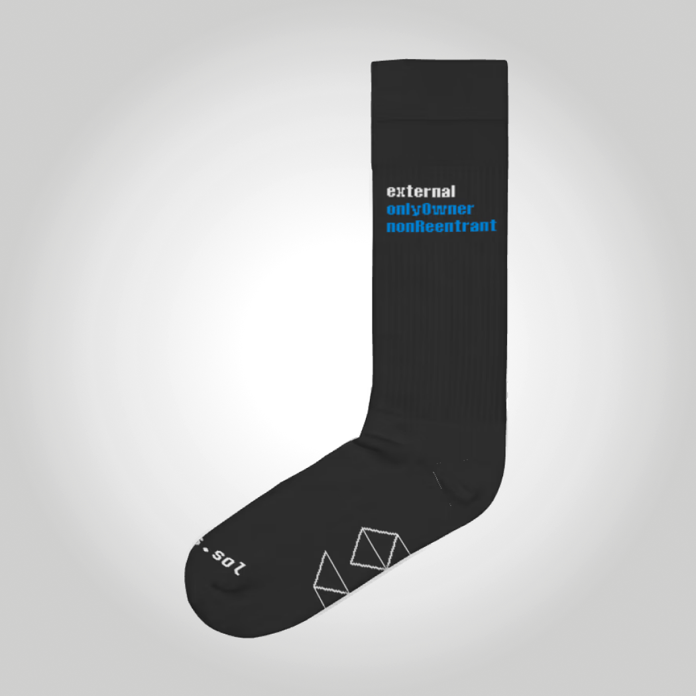
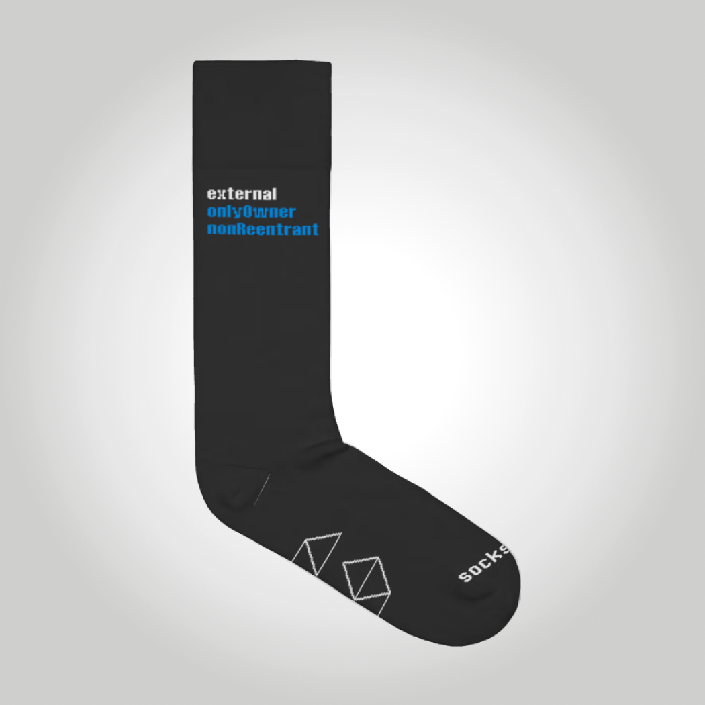

# 🧦.sol

Solidity 🧦 from Devcon Bogota.

Deployed at [0xdfcCFA821F0bFD9d90746021094FAf6C0f10AB63](https://etherscan.io/address/0xdfcCFA821F0bFD9d90746021094FAf6C0f10AB63).

## Minting

Minting is free and can be done until [Wed Nov 09 2022 12:52:23 GMT+0000](https://etherscan.io/address/0xdfccfa821f0bfd9d90746021094faf6c0f10ab63#readContract#F3).

To mint, call the `mint()` function:

- `mint` via [etherscan](https://etherscan.io/address/0xdfccfa821f0bfd9d90746021094faf6c0f10ab63#writeContract#F1).
- Using foundry, any of the following (see `cast send --help` on how to sign the tx).
  - `cast send 0xdfcCFA821F0bFD9d90746021094FAf6C0f10AB63 "mint()"`
  - `cast send soliditysocks.eth "mint()"`
  - `cast send solidity🧦.eth "mint()"`

## Socks

Each mint will get you a pseudo-random sock: either left or right.

 

## Physical version

You can pick up a physical version of the NFT, i.e., a pair of real socks at the Devcon Bogota booth
for Solidity, regardless of whether you own the digital one!

## Marketplaces

- [Opensea](https://opensea.io/collection/sol-v4-1)
- [LooksRare](https://looksrare.org/collections/0xdfcCFA821F0bFD9d90746021094FAf6C0f10AB63)
- [Rarible](https://rarible.com/collection/0xdfccfa821f0bfd9d90746021094faf6c0f10ab63)
